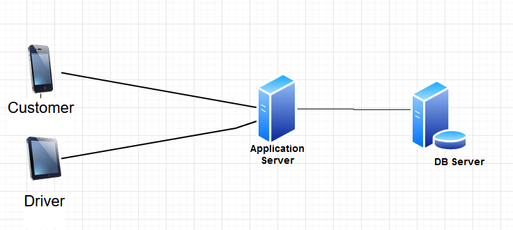

## Introduction

- This System should match cusomers to nearby drivers.

## Requirements and Goals of the System

- Our system will be matching customers to nearby drivers.
- There are two types of users in our system:
  - Drivers
  - Customers.


- Functional Requirements
  - Cusomers should be able to register
  - Cusomers should be able to request a trip
  - Drivers should be able to register.
  - Drivers should be able to accept a trip.

- Non-Functional Requirements
  - The system should be highly available.
  - The system should provide real-time trip tracking.

## Scale Estimation
- Let’s assume we have 3K customers and 1K drivers with 1K daily active customers and 300 active drivers.
- Let’s assume 600 daily trip.
- Let’s assume that all active drivers notify their current location every three seconds.

- Traffic estimates: let’s assume here that we get one 600 trip added to our system every day.
    ```
    600 / (24 hours) = 25 trip per hour
    ```
- Storage estimates:  les't estimate our storage needs for 5 years
   ```
    25 * 24 hour * 366 (days in one year) * 5 years * 500 Byte (fro one tript) = 549.098.000 Byte = 500 GB
   ```

## API
- We can have REST or RPC APIs to expose the functionality of our system. 
- The following could be the definition of the API for clients:

```js
  registerCustomer(custmerName, customerPhone, customerEmail)
```
```js
  registerDriver(driverName, dirverPhone, driverEmail, driverLicenceNumber)
```
```js
  requestTrip(customerId, fromLat, fromLang, toLat, toLang)
```
```js
  acceptTrip(driverId)
```

## Basic System Design and Algorithm
How would “Request Trip” use case work?
  - The customer will create a request for a trip.
  - The server will take the request and returns nearby drivers.
  - The server collects all the results and sorts them by ratings.
  - The server will send a notification to the top (say three) drivers simultaneously, whichever driver accepts the request first will be assigned the ride. The other drivers will receive a cancellation request.
  - Once a driver accepts a request, the customer is notified.

How would the matching Algirithm work ?
  - Hungarian algorithm which solves the assignment problem is a good option for our use case, the only difference here is that the algorithm returns the min cost and for our case we are searching for the max score for matching a customer to a driver and that's easy to fix, just subtract a MAX number from all the scores in the matrix.

## Database Desing
  - We need to store millions of records.
  - Each object we store is small (less than 1K).
  - Our system is read-heavy.
  
  - We can use RDBMS like MySQL since we require joins. But relational databases come with their challenges, especially when we need to scale them.
  - We can store the above schema in a distributed key-value store to enjoy the benefits offered by NoSQL
  - NoSQL stores, in general, always maintain a certain number of replicas to offer reliability.


## Database Schema
  

## High Level Design
  
  
## Load balancing
We will need a load balancer in front of our application servers (we will add more servers) that can map requests to our application servers using Round Rubin algorithm.


  
